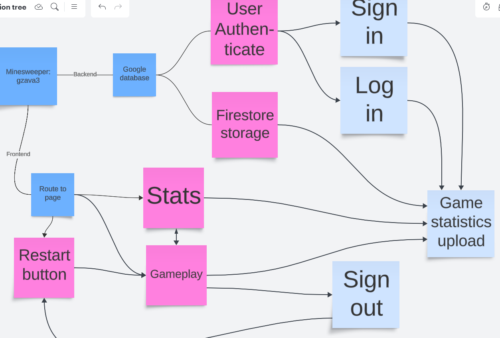

# Quick Web Games 

Contributors: 
Brian Ngeunjuntr (bngeu2): Frontend Design, Home Page, Search Page with filtering functionality, Hangman
Gio Zavalza (gzava3): Backend Design, Firebase integration, Login Authorization, Minesweeper
Kathryn Chappel (chappel4): 
Linda Yan (linday2): Frontend Design

## To deploy the game:
download the folder, open it in editor, and run "npm install", "npm start" in the terminal

## Introduction
This project was bootstrapped with [Create React App](https://github.com/facebook/create-react-app).
 
We focuses on the front-end development and provide quick and convenient access for users to play Hangman, Minesweeper and Ultimate Tic Tac Toe.

## Front-end Design

users will first enter the welcome page shown below:

 
Clicking the "start now" button will lead users to our Home Page.
 
We design our home page with components Header, Search Bar, Carousel and Game Navigation.

## MineSweeper

## MineSweeper Game Overview

This application is a digital version of the classic Minesweeper game, developed using React and Firebase. Below is an overview of the game's architecture and user flow based on the provided flowchart and source code:

### Game Components and Flow

- **Frontend (React)**: The user interface is built with React, facilitating dynamic interactions within the web browser. The game board is rendered with a grid representing cells that can contain mines.

- **Google Firebase**:
  - **Firestore Storage**: Used to store game statistics and user data securely.
  - **Authentication**: Manages user sessions, allowing users to sign in or log out.

### User Flow:

1. **User Authentication**:
   - **Sign In/Log In**: Users can authenticate themselves using the sign-in/log-in feature. This action integrates with Firebase Authentication to manage user sessions.

2. **Gameplay**:
   - Users play by clicking cells to reveal whether they contain a mine.
   - The first click initializes the board with mines placed away from the initial click area.
   - Users can mark suspected mines with flags.
   - The game tracks several statistics such as number of clicks, flags, and time elapsed.

3. **Game Statistics**:
   - After logging in, all game statistics are uploaded to Firebase under the user's account.
   - Statistics include total time spent, number of clicks, game outcome, and bombs remaining.

4. **Additional Features**:
   - **Restart Button**: Allows users to restart the game at any time, resetting the board and all counters.
   - **Stats**: Users can view their gameplay statistics, enhancing engagement by tracking progress over time.

5. **Sign Out**:
   - Users can sign out, which ends their session and takes them back to the authentication screen.

### Integration Points:

- **Firebase Authentication (AuthModal and LogoutModal)**: Handles user authentication states. If no user is detected, an authentication modal is prompted. If a user is signed in, a logout modal appears instead.
- **Firestore Database**: Stores individual game sessions under user-specific documents, which include detailed statistics for each game played.

### Implementation Details:

- **React Hooks**: Utilize `useState` and `useEffect` to manage state and side effects within the game.
- **Firebase Firestore**: Used for data persistence, storing user statistics in a structured format.
- **Event Handling**: Includes handling of cell clicks to either reveal the cell or place/remove a flag, with right-click actions managed separately.

### Screenshot:
Here is a visual representation of the game structure and its components:

This overview provides a clear picture of how the Minesweeper game functions, from user authentication to gameplay and statistics management, all integrated with Google Firebase for backend operations.

## Ultimate Tic Tac Toe
This game is constituted with 9 ordinary tic tac toe games, arranged in 3*3 format.
 
Users will play in turns as "X" and "O" to try to win as many small tic tac toe games as possible.
 
The current number of wins and draws are displayed on the bottom.
 
Users can reset the game by "reset" button.

